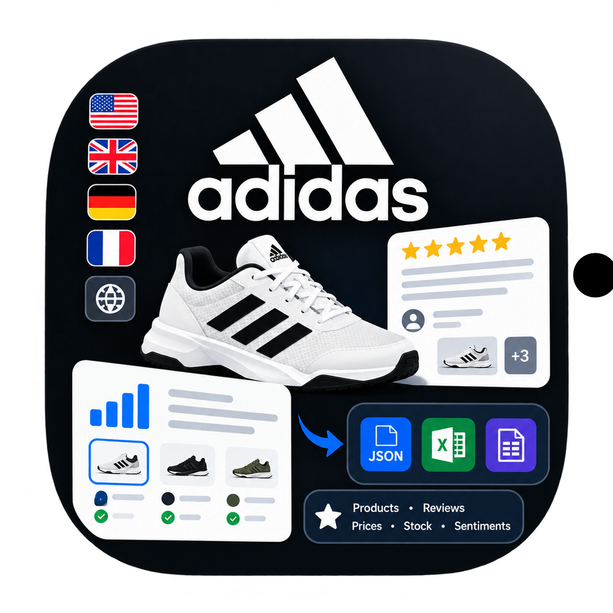

# 🔥 Adidas Product & Reviews Scraper 🔥

<p align="center">
    
</p>

<p align="center">
    
    
    
</p>

<p align="center" style="border: 1px solid blue; padding: 10px; border-radius: 12px;"><i>The most comprehensive and reliable Adidas Scraper on Apify for BOTH products and reviews. Bypasses Akamai anti-bot protection 🔥. Scrape product prices, all variants, SKUs, all media, user sentiments, all reviews, and more from 12 <a href="#supported-countries">supported Adidas store countries</a>. Configure your favorite searches on the Adidas website and just dump the URLs to this powerful scraper. Alternatively, provide direct product URLs. (27+ fields/product & 21+ fields/review)</i></p>

<p align="center" style="border: 1px solid orange; padding: 10px; border-radius: 12px;">
  <b>Encountered an error while using the Actor or have a feature suggestion?</b> <i>Let me know by opening a new <a href="https://apify.com/coding-doctor-omar/adidas-scraper/issues/open">issue</a> and explaining the error — I'm active and usually fix things within a day.</i>
</p>

<p align="center" style="border: 1px solid green; padding: 10px; border-radius: 12px;">
  <b>Like this Actor?</b> <i>Please leave a 5-star <a href="https://console.apify.com/actors/mw5JvRF7kSxjfNqdu/reviews">review</a> on Apify to support me and help others find the Actor ❤️.</i>
</p>

<p align="center"><a href="https://apify.com/coding-doctor-omar/adidas-scraper/input-schema">Input</a> • <a href="https://apify.com/coding-doctor-omar/adidas-scraper/api/python">API Docs</a> • <a href="#changelog">Changelog</a></p>

## Quickstart Tutorial Video 📽️

Coming Soon...

## Scraper Modes

Below are the modes available in **Adidas Product & Reviews Scraper**. Details about each of these modes are provided in the coming sections.

1. **Products Mode**: Scrapes highly detailed product data, such as `productSentiments`, `productCategory`, `productColor`, `productAvailability`, `productRating`, `productReviewCount`, `productPrice`, `productDiscountPercentage`, `productVariants`, `productImages`, `productVideos`, and many other fields. For each color variant, it scrapes detailed variant availabilities per size variant/SKU. You can scrape product details from direct `productUrls` or by `searchUrls` or both.
2. **Reviews Mode**: Scrapes highly detailed review data, such as `reviewTitle`, `reviewText`, `reviewRating`, `reviewUserNickname` `reviewRatingRange`, `reviewLocale`, `reviewIamges`, `reviewLikes`, `reviewDislikes`, `reviewBadges`, `questionsAnsweredFromReview`, and more. You can scrape reviews from direct `productUrls` or by `searchUrls` or both.

At the end of each scrape, select the **Products** view tab in the output secion to see product details, if you are on **Products Mode**, or select the **Reviews ✏️** view tab in the output section to see reviews details, if you are on **Reviews Mode**.

**Always verify your scraping mode** before running the Actor to avoid wasting credits on the wrong mode.

## Example Product Output

```json
{
  "scrapedAt": "2026-10-01T09:29:10.804307+00:00",
  "dataType": "product",
  "productId": "KK3857",
  "productName": "Courtflash Tennis Shoes Kids",
  "productUrl": "https://www.adidas.com/us/courtflash-tennis-shoes-kids/KK3857.html",
  "productModelNumber": "NMP46",
  "productDescription": "Tennis speedsters need lightweight, comfortable footwear that keeps up with their game. These kids' Courtflash shoes from adidas have a mesh upper for cool play and a durable Adiwear outsole that easily stands up to quick cuts and fast footwork. Whether your young athlete is learning the basics or already acing serves, these shoes will deliver the all-court performance they need.",
  "productThirdPartyOptions": [],
  "productRating": 4.8,
  "productReviewCount": 90,
  "productSentiments": [
    "Customers consistently praise lightweight, cushioned comfort with perfect true-to-size fit and no break-in needed",
    "Most highlight durable, high-quality construction withstanding heavy daily use on hard courts and clay surfaces",
    "Reviewers appreciate flexible, grippy soles suited for multiple court types and active play",
    "Many call the modern, stylish design beautiful and eye-catching while maintaining timeless appeal",
    "Customers emphasize exceptional value for quality, with strong intent to repurchase and recommend"
  ],
  "productBadges": [],
  "productPrice": 44,
  "productOriginalPrice": 55,
  "productDiscountPercentage": 20.0,
  "productPriceCurrency": "USD",
  "productAvailability": 159,
  "productAvailabilityStatus": "IN_STOCK",
  "productPurchaseLimit": 10,
  "productColor": "Dark Blue / Cloud White / Bright Blue",
  "productCategory": "shoes",
  "productCategorySlug": "us/kids-shoes",
  "productGender": "kids",
  "productTotalColors": 2,
  "productVariants": [
    {
      "variantId": "KK3857",
      "variantUrl": "https://www.adidas.com/us/courtflash-tennis-shoes-kids/KK3857.html",
      "variantColor": "Dark Blue / Cloud White / Bright Blue",
      "variantSizeVariations": [
        {
          "sku": "KK3857_370",
          "availability": 0,
          "availabilityStatus": "NOT_AVAILABLE",
          "size": "10.5K"
        },
        {
          "sku": "KK3857_380",
          "availability": 0,
          "availabilityStatus": "NOT_AVAILABLE",
          "size": "11K"
        },
        {
          "sku": "KK3857_390",
          "availability": 0,
          "availabilityStatus": "NOT_AVAILABLE",
          "size": "11.5K"
        },
        {
          "sku": "KK3857_410",
          "availability": 0,
          "availabilityStatus": "NOT_AVAILABLE",
          "size": "12K"
        },
        {
          "sku": "KK3857_420",
          "availability": 0,
          "availabilityStatus": "NOT_AVAILABLE",
          "size": "12.5K"
        },
        {
          "sku": "KK3857_430",
          "availability": 0,
          "availabilityStatus": "NOT_AVAILABLE",
          "size": "13K"
        },
        {
          "sku": "KK3857_440",
          "availability": 0,
          "availabilityStatus": "NOT_AVAILABLE",
          "size": "13.5K"
        },
        {
          "sku": "KK3857_450",
          "availability": 15,
          "availabilityStatus": "IN_STOCK",
          "size": "1"
        },
        {
          "sku": "KK3857_470",
          "availability": 15,
          "availabilityStatus": "IN_STOCK",
          "size": "1.5"
        },
        {
          "sku": "KK3857_480",
          "availability": 15,
          "availabilityStatus": "IN_STOCK",
          "size": "2"
        },
        {
          "sku": "KK3857_490",
          "availability": 15,
          "availabilityStatus": "IN_STOCK",
          "size": "2.5"
        },
        {
          "sku": "KK3857_510",
          "availability": 15,
          "availabilityStatus": "IN_STOCK",
          "size": "3"
        },
        {
          "sku": "KK3857_520",
          "availability": 15,
          "availabilityStatus": "IN_STOCK",
          "size": "3.5"
        },
        {
          "sku": "KK3857_530",
          "availability": 15,
          "availabilityStatus": "IN_STOCK",
          "size": "4"
        },
        {
          "sku": "KK3857_540",
          "availability": 13,
          "availabilityStatus": "IN_STOCK",
          "size": "4.5"
        },
        {
          "sku": "KK3857_550",
          "availability": 15,
          "availabilityStatus": "IN_STOCK",
          "size": "5"
        },
        {
          "sku": "KK3857_560",
          "availability": 10,
          "availabilityStatus": "IN_STOCK",
          "size": "5.5"
        },
        {
          "sku": "KK3857_570",
          "availability": 15,
          "availabilityStatus": "IN_STOCK",
          "size": "6"
        },
        {
          "sku": "KK3857_580",
          "availability": 0,
          "availabilityStatus": "NOT_AVAILABLE",
          "size": "6.5"
        },
        {
          "sku": "KK3857_590",
          "availability": 1,
          "availabilityStatus": "IN_STOCK",
          "size": "7"
        }
      ]
    },
    {
      "variantId": "KK3865",
      "variantUrl": "https://www.adidas.com/us/courtflash-tennis-shoes-kids/KK3865.html",
      "variantColor": "Cloud White / Core Black / Cloud White",
      "variantSizeVariations": [
        {
          "sku": "KK3865_370",
          "availability": 0,
          "availabilityStatus": "NOT_AVAILABLE",
          "size": "10.5K"
        },
        {
          "sku": "KK3865_380",
          "availability": 0,
          "availabilityStatus": "NOT_AVAILABLE",
          "size": "11K"
        },
        {
          "sku": "KK3865_390",
          "availability": 0,
          "availabilityStatus": "NOT_AVAILABLE",
          "size": "11.5K"
        },
        {
          "sku": "KK3865_410",
          "availability": 0,
          "availabilityStatus": "NOT_AVAILABLE",
          "size": "12K"
        },
        {
          "sku": "KK3865_420",
          "availability": 0,
          "availabilityStatus": "NOT_AVAILABLE",
          "size": "12.5K"
        },
        {
          "sku": "KK3865_430",
          "availability": 0,
          "availabilityStatus": "NOT_AVAILABLE",
          "size": "13K"
        },
        {
          "sku": "KK3865_440",
          "availability": 0,
          "availabilityStatus": "NOT_AVAILABLE",
          "size": "13.5K"
        },
        {
          "sku": "KK3865_450",
          "availability": 15,
          "availabilityStatus": "IN_STOCK",
          "size": "1"
        },
        {
          "sku": "KK3865_470",
          "availability": 15,
          "availabilityStatus": "IN_STOCK",
          "size": "1.5"
        },
        {
          "sku": "KK3865_480",
          "availability": 15,
          "availabilityStatus": "IN_STOCK",
          "size": "2"
        },
        {
          "sku": "KK3865_490",
          "availability": 15,
          "availabilityStatus": "IN_STOCK",
          "size": "2.5"
        },
        {
          "sku": "KK3865_510",
          "availability": 15,
          "availabilityStatus": "IN_STOCK",
          "size": "3"
        },
        {
          "sku": "KK3865_520",
          "availability": 15,
          "availabilityStatus": "IN_STOCK",
          "size": "3.5"
        },
        {
          "sku": "KK3865_530",
          "availability": 15,
          "availabilityStatus": "IN_STOCK",
          "size": "4"
        },
        {
          "sku": "KK3865_540",
          "availability": 11,
          "availabilityStatus": "IN_STOCK",
          "size": "4.5"
        },
        {
          "sku": "KK3865_550",
          "availability": 15,
          "availabilityStatus": "IN_STOCK",
          "size": "5"
        },
        {
          "sku": "KK3865_560",
          "availability": 14,
          "availabilityStatus": "IN_STOCK",
          "size": "5.5"
        },
        {
          "sku": "KK3865_570",
          "availability": 15,
          "availabilityStatus": "IN_STOCK",
          "size": "6"
        },
        {
          "sku": "KK3865_580",
          "availability": 0,
          "availabilityStatus": "NOT_AVAILABLE",
          "size": "6.5"
        },
        {
          "sku": "KK3865_590",
          "availability": 0,
          "availabilityStatus": "NOT_AVAILABLE",
          "size": "7"
        }
      ]
    }
  ],
  "productImages": [
    "https://assets.adidas.com/images/w_1200,f_auto,q_auto/1a0f638dc9ce4dc9b2518ee093450794_9366/Courtflash_Tennis_Shoes_Kids_Blue_KK3857_HM1.jpg",
    "https://assets.adidas.com/images/w_1200,f_auto,q_auto/755582473af2421899e29add8e5ceb9d_9366/Courtflash_Tennis_Shoes_Kids_Blue_KK3857_HM3_hover.jpg",
    "https://assets.adidas.com/images/w_1200,f_auto,q_auto/cd85785c8da447ae916b6c6900bb3f1e_9366/Courtflash_Tennis_Shoes_Kids_Blue_KK3857_HM4.jpg",
    "https://assets.adidas.com/images/w_1200,f_auto,q_auto/275c2e17eb3a48eeacdafea2e1bd6aa2_9366/Courtflash_Tennis_Shoes_Kids_Blue_KK3857_HM5.jpg",
    "https://assets.adidas.com/images/w_1200,f_auto,q_auto/45ee7650f34a4d68869a893a1ecb5e52_9366/Courtflash_Tennis_Shoes_Kids_Blue_KK3857_HM6.jpg",
    "https://assets.adidas.com/images/w_1200,f_auto,q_auto/dddcd33ae6f34b029e2232ba88d315b5_9366/Courtflash_Tennis_Shoes_Kids_Blue_KK3857_HM7.jpg",
    "https://assets.adidas.com/images/w_1200,f_auto,q_auto/b9988cb03a414ef68625449acf0b2e5b_9366/Courtflash_Tennis_Shoes_Kids_Blue_KK3857_HM8.jpg",
    "https://assets.adidas.com/images/w_1200,f_auto,q_auto/7ed20e8113934a21bb55848f58baea08_9366/Courtflash_Tennis_Shoes_Kids_Blue_KK3857_HM9.jpg",
    "https://assets.adidas.com/images/w_1200,f_auto,q_auto/052b15da996b4fc0bd1e0d8bf210f621_9366/Courtflash_Tennis_Shoes_Kids_Blue_KK3857_HM10.jpg",
    "https://assets.adidas.com/images/w_1200,f_auto,q_auto/daa13b55ad5e4e72a6967d20e1d50246_9366/Courtflash_Tennis_Shoes_Kids_Blue_KK3857_HM11.jpg"
  ],
  "productVideos": [
    "https://assets.adidas.com/videos/t_videomain/87c2ae61164c41148ba29bb2fb17e980_d98c/Courtflash_Tennis_Shoes_Kids_Blue_KK3857_video.mp4"
  ]
}
```

## Example Review Output

```json
{
  "scrapedAt": "2026-10-01T13:29:21.607387+00:00",
  "dataType": "review",
  "productId": "KK3857",
  "productName": "Courtflash Tennis Shoes Kids",
  "productUrl": "https://www.adidas.com/us/courtflash-tennis-shoes-kids/KK3857.html",
  "productModelNumber": "NMP46",
  "reviewId": "183699730",
  "reviewUserNickname": "Alkurosaki",
  "reviewRating": 1,
  "reviewRatingRange": 5,
  "reviewTitle": "Not durable; won't recommend.",
  "reviewSubmissionTime": "2026-08-08T09:02:07.000+00:00",
  "reviewText": "Size is slightly on the tight/small side and material feels very cheap. Stitches near laces and heel already coming loose.",
  "reviewLikes": 0,
  "reviewDislikes": 0,
  "reviewProductColor": "Cloud White / Silver Metallic / Core Black",
  "userRecommendsProduct": false,
  "questionsAnsweredFromReview": [],
  "reviewImages": [
    "https://photos-eu.bazaarvoice.com/photo/2/cGhvdG86YWRpZGFzZ2xvYmFs/7aa45684-bd38-52c4-8fa7-c2418fc94e0f",
    "https://photos-eu.bazaarvoice.com/photo/2/cGhvdG86YWRpZGFzZ2xvYmFs/28795c50-4c20-5e70-a86f-d0fcbbd17350"
  ],
  "reviewBadges": [
    "VerifiedPurchaser",
    "IncentivizedReview"
  ],
  "reviewLocale": "en_GB"
}
```

**Check the [output schema](https://apify.com/coding-doctor-omar/adidas-scraper/output-schema) for more details on the output fields of Adidas Products & Reviews Scraper.**

## Features ✨

- 🛍️ **Two Scraping Modes in One Actor**: Switch between `products` and `reviews` mode to get detailed product data or customer reviews.

- 🌍 **12 Adidas Stores Supported**: Scrape the US, UK, Canada (English & French), Germany, France, Netherlands, Spain, Italy, Japan, Australia, and New Zealand websites.

- 🔎 **Search URL Support**: Set up any search or filters on the Adidas website, paste the URL into the Actor, and it will pick up your filters automatically.

- 🔗 **Direct Product URLs**: Scrape specific products by URL, or combine them with search URLs in the same run.

- 💰 **Pricing & Discount Data**: Get the current price, original price, discount percentage, and currency for every product.

- 📦 **Per-Size Stock Tracking**: See stock counts, availability status, and SKUs for every size of every color variant, plus the total stock and purchase limit for each product.

- 🎨 **Color Variants**: Capture every color variant of a product, with its own ID, URL, color name, and size breakdown.

- 🖼️ **Complete Media Collection**: Get all product image and video URLs listed on the product detail page.

- 🏷️ **Badges & Third-Party Options**: Extract product badges (like "Best Seller") and third-party buy options (like PRIME).

- 🤖 **AI Sentiment Summaries**: Get the AI-generated customer sentiment highlights that Adidas shows for each product, along with its rating and review count.

- ⭐ **Rich Review Data**: Collect review titles, text, ratings, nicknames, submission dates, likes and dislikes, the product color reviewed, and whether the buyer recommends the product.

- 📸 **Review Photos & Badges**: Get the images buyers attach to their reviews and badges such as `VerifiedPurchaser` and `IncentivizedReview`.

- 👥 **Buyer Demographics**: Capture the demographic questions and answers attached to each review, plus the reviewer's locale.

- 🗣️ **Reviews from All Languages**: Optionally include reviews written in any language, not just the selected country's.

- 🔀 **Flexible Review Sorting**: Sort reviews by `newest`, `relevant`, `helpful`, `highestRated`, or `lowestRated`.

- 🎛️ **Fine-Grained Limits**: Cap results with total limits and per-search or per-product limits for products and reviews. Use `0` for unlimited.

- 🛡️ **Akamai Anti-Bot Bypass**: Works reliably against Adidas's anti-bot protection, so your runs complete.

- 📊 **Large Structured Dataset**: 27+ fields per product and 21+ fields per review, with dedicated **Products** and **Reviews ✏️** output views.

- 💾 **Multiple Export Formats**: Download your data as JSON, CSV, or Excel, or access it through the Apify API.

## Input Options

1. **Mode** (`mode`) &mdash; The scraping mode, either `products` or `reviews`. Don't forget to choose the correct mode for your use case before you run the Actor.
2. **Country** (`country`) &mdash; The website country to scrape from. Make sure your provided URLs are from the country you selected. If you select a country and provide URLs for another country, the scraper will skip those URLs. Currently, there are [12 countries](#supported-countries) supported in **Adidas Products & Reviews Scraper**.
3. **Search URLs** (`searchUrls`) &mdash; The search URLs to scrape from (whether product details or reviews). You can configure all the filters you want on Adidas and then come here and provide the search URLs. This scraper auto-detects filters from URLs.
4. **Product URLs** (`productUrls`) &mdash; This option specifies a list of product URLs to include in the scraping (whether for product details or reviews).
5. **Maximum Products** (`maxProducts`) &mdash; The maximum total products to scrape (whether product details or reviews). Use `0` for unlimited.
6. **Maximum Products Per Search** (`maxProductsPerSearch`) &mdash; The maximum products to scrape from each search URL (whether product details or reviews). Use `0` for unlimited.
7. **Maximum Reviews** (`maxReviews`) &mdash; The maximum total number of reviews to scrape (`reviews` mode only). Use `0` for unlimited.
8. **Maximum Reviews Per Product** (`maxReviewsPerProduct`) &mdash; The maximum number of reviews to scrape for each product (`reviews` mode only). Use `0` for unlimited.
9.  **Reviews Sort** (`reviewsSort`) &mdash; Specifies how to sort the reviews for each product (not across products). Options are `newest` (default), `relevant`, `helpful`, `highestRated`, and `lowestRated`.
10. **Scrape Reviews from All Languages** (`scrapeReviewsFromAllLanguages`) &mdash; If enabled, the scraper will not just scrape reviews of the same language as the selected country, but will include reviews from ALL languages for each product.

**Note**: *If you do not provide any `searchUrls` or `productUrls`, the scraper will scrape 10 random products (if on `products` mode) or 10 random reviews (if on `reviews` mode), so be sure to provide URLs.*

Below is an example input for scraping all reviews from 2 products, sorted by `newest`:

```json
{
    "mode": "reviews",
    "country": "united-states",
    "maxProducts": 0,
    "maxProductsPerSearch": 0,
    "maxReviews": 0,
    "maxReviewsPerProduct": 0,
    "reviewsSort": "newest",
    "scrapeEntireWebsite": false,
    "productUrls": [
        {"url": "https://www.adidas.com/us/courtflash-tennis-shoes-kids/KK3857.html"},
        {"url": "https://www.adidas.com/us/handball-spezial-shoes/KK1153.html"}
    ]
}
```

## Supported Countries

1. United States (adidas.com/us)
2. United Kingdom (adidas.co.uk)
3. Canada English (adidas.ca/en)
4. Canada French (adidas.ca/fr)
5. Germany (adidas.de)
6. France (adidas.fr)
7. Netherlands (adidas.nl)
8. Spain (adidas.es)
9. Italy (adidas.it)
10. Japan (adidas.jp)
11. Australia (adidas.com.au)
12. New Zealand (adidas.co.nz)

## How to Use

1. Click the blue **Try for free** button in the top of this page.
2. Sign in to your Apify account or create a free account (no credit card required).
3. Configure your input options as explained above.
4. Click the green **Start** or **Save and start** button at the bottom to start the Actor.
5. You will find the results in the output tab. Select the **Products** view to see product details (`products` mode) or **Reviews** tab to see product reviews (`reviews` mode).

